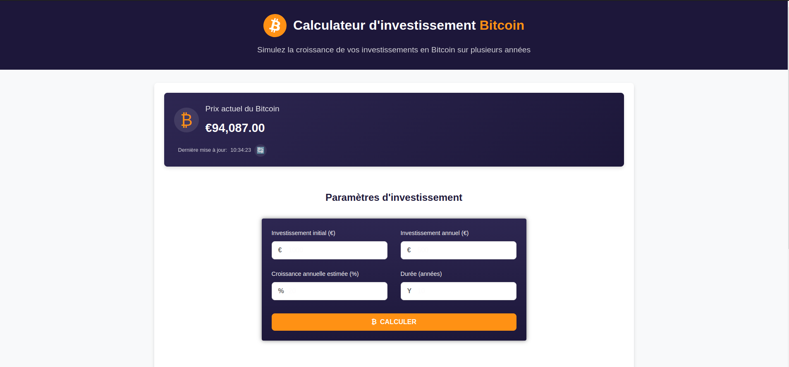

# Calculateur d'Investissement Bitcoin



Une application web moderne pour simuler et projeter les rendements potentiels des investissements en Bitcoin sur plusieurs années.

## 🇫🇷 Présentation du Projet

### Objectif
Le Calculateur d'Investissement Bitcoin est un outil conçu pour aider les investisseurs à visualiser et à comprendre comment leurs investissements en Bitcoin pourraient évoluer au fil du temps. En tenant compte des paramètres d'investissement personnalisés et des données de prix en temps réel, l'application fournit des projections détaillées année par année.

### Fonctionnalités
- **Prix Bitcoin en Temps Réel**: Affichage du prix actuel du Bitcoin en EUR via l'API CoinGecko
- **Mise à Jour Automatique**: Actualisation du prix toutes les minutes avec possibilité de rafraîchissement manuel
- **Paramètres d'Investissement Personnalisables**:
  - Investissement initial
  - Contribution annuelle
  - Taux de croissance annuel estimé
  - Durée de l'investissement (1-50 ans)
- **Résultats Détaillés**:
  - Résumé de l'investissement total, valeur finale et gains
  - Tableau année par année montrant l'évolution du prix, la quantité de Bitcoin, la valeur totale et les gains/pertes

### Aspects Techniques
L'application est développée avec Angular 18, utilisant une architecture moderne basée sur les composants et les services. Les principales caractéristiques techniques incluent:

- **Architecture Réactive**: Utilisation des signaux Angular pour une gestion d'état réactive
- **API REST**: Intégration avec l'API CoinGecko pour les données de prix en temps réel
- **Modèle de Calcul**: Algorithme de projection qui simule l'évolution des investissements en tenant compte des contributions annuelles et de la croissance estimée
- **Interface Utilisateur Responsive**: Design moderne et adaptatif pour une expérience utilisateur optimale sur tous les appareils

## 🇬🇧 Project Overview

### Purpose
The Bitcoin Investment Calculator is a tool designed to help investors visualize and understand how their Bitcoin investments might evolve over time. By considering customized investment parameters and real-time price data, the application provides detailed year-by-year projections.

### Features
- **Real-time Bitcoin Price**: Displays the current Bitcoin price in EUR via the CoinGecko API
- **Automatic Updates**: Refreshes the price every minute with manual refresh capability
- **Customizable Investment Parameters**:
  - Initial investment
  - Annual contribution
  - Estimated annual growth rate
  - Investment duration (1-50 years)
- **Detailed Results**:
  - Summary of total investment, final value, and gains
  - Year-by-year table showing price evolution, Bitcoin quantity, total value, and gains/losses

### Technical Aspects
The application is developed with Angular 18, using a modern component and service-based architecture. Key technical features include:

- **Reactive Architecture**: Using Angular signals for reactive state management
- **REST API**: Integration with CoinGecko API for real-time price data
- **Calculation Model**: Projection algorithm that simulates investment evolution considering annual contributions and estimated growth
- **Responsive UI**: Modern, adaptive design for optimal user experience across all devices

## Installation et Utilisation / Installation and Usage

### Prérequis / Prerequisites
- Node.js (v18+)
- npm (v9+)

### Installation
```bash
# Cloner le dépôt / Clone the repository
git clone https://github.com/your-username/calculator-bitcoin.git
cd calculator-bitcoin

# Installer les dépendances / Install dependencies
npm install
```

### Développement / Development
```bash
# Démarrer le serveur de développement / Start the development server
ng serve

# Accéder à l'application / Access the application
# Ouvrez votre navigateur à / Open your browser at: http://localhost:4200
```

### Production
```bash
# Construire l'application pour la production / Build the application for production
ng build --prod

# Les fichiers générés se trouvent dans le dossier 'dist/' / Generated files are in the 'dist/' folder
```

## Avertissement / Disclaimer
Les résultats fournis par cette application sont des estimations basées sur les paramètres entrés et ne constituent pas des conseils financiers. Les performances passées ne garantissent pas les résultats futurs. Investir dans les cryptomonnaies comporte des risques significatifs.

## Licence / License
MIT
